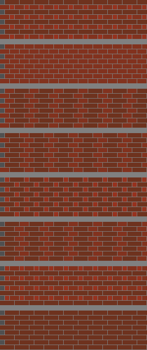

# Brickwork

Generate interlocked brick patterns.

# Usage

    brickwork [rows] [bricks] [widest]

Unspecified argements are set to 2.

The number of patterns generated is printed to standard output. Walls are rendered in
"brickwork.svg". Thanks to [simple-svg](https://github.com/adishavit/simple-svg).

# Example

To generate all walls with alternating rows made with a repeating pattern of two bricks
that may be 1, 2, or 3 units wide, execute

    brickwork 2 2 3

Then "brickwork.svg" contains

# Details

The criterion for picking rows for the walls is that the vertial gaps between bricks, the
should never align with gaps in adjacent rows. To use the jargon, *perpends* must not be
contiguous across *courses* of bricks. A brick of width 1 is inserted at the beginning
alternate cousres to provide an offset, or *lap*.

# Math

Of course, all this was done in hope of finding something mathematically interesting. And
there are a few tidbits.

First, without a lap, we're doomed. Courses of repeating paetterns align when *aX* = *bY*,
where *a* and *b* are integers and *X* and *Y* are the total widths of the repeating
patterns on adjacent courses. One solution is *a* = *Y*, *b* = *X*. The first alignment
happens at the least common multiple of *X* and *Y*.

With a lap of 1, we have *aX* - *bY* = 1. [Bézout's
identity](https://en.wikipedia.org/wiki/B%C3%A9zout%27s_identity) says that this equation
can be satisfied if gcd(*X*, *Y*) = 1. I.e. if *X* and *Y* are coprime. So, Brick widths
on adjacent courses must have common factors if we're to avoid contiguous laps.

What if courses are made up of alternating bricks? If the widths are *x*1 and *x*2 with a
combined width of *X* on one course and *y*1 and *y*2 with a combined width of *Y* on the
other, we still have the condition *aX* - *bY* ≠ 1 which ensures that the perpends at the
ends of the pairs don't align. But we also have to ensure that the ends don't align with
the middles, and the middles don't align with each other.

To check if the middle of the x-course pattern aligns with the end of the y-course
pattern, imagine that the x-course starts with the 2nd brick and consists of the pattern
{*x*2, *x*1, ...}. The lap is then 1 - *x*1, since that's the offset of the y-course with
respect to the 2nd brick in the x-course. This gives the condition *aX* - *bY* ≠ 1 - *x*1.

The remaining conditions are found by starting with the 2nd brick in the y-course and
starting with the 2nd brick on both courses. The full set of conditions is then

*aX* - *bY* ≠ 1

*aX* - *bY* ≠ 1 - *x*1

*aX* - *bY* ≠ 1 + *y*1

*aX* - *bY* ≠ 1 - *x*1 + *y*1

These equations are satisfied if gcd(*X*, *Y*) = the right hand-side. But there are
additional solutions for multiples of the right-hand side. If *aX* - *bY* ≠ 1 - *x*1, then
*a'X* - *b'Y* ≠ n(1 - *x*1), where *a'* = *na* and *b'* = *nb*. So, to test if a set of
widths makes a good brickwork, we can check that the right-hand sides of the equations
above are not multiples of gcd(*X*, *Y*). Note that if gcd(*X*, *Y*) = 1, then all the
right-hand sides are multiples of gcd(*X*, *Y*), so there's no need to check the first
case. In other words, if the ends of the patterns align, everything else will too,
somewhere.

*c* ≢ 0 (mod gcd(*X*, *Y*)) for all *c* in {1 - *x*1, 1 + *y*1, 1 - *x*1 + *y*1}

# Building

    mkdir build
    meson build/
    ninja test -C build/
